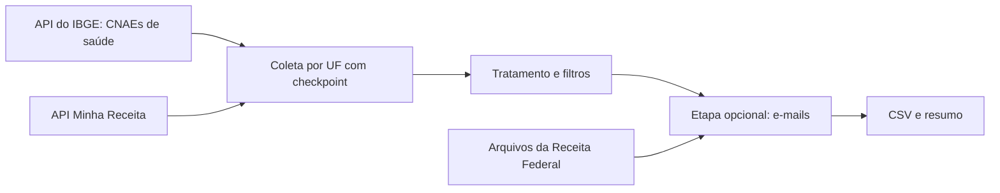

# OSCs de saúde a partir de dados públicos de CNPJ

Pipeline em Python que encontra organizações da sociedade civil (OSCs) ativas que atuam em saúde no Brasil, usando só dados públicos, e entrega uma tabela pronta para análise.

Nasceu de uma demanda de pesquisa: montar uma lista de contato de associações, fundações e organizações sociais da área da saúde. A primeira versão era um notebook do Google Colab. Este repositório é a versão reescrita como projeto: com módulos, testes, linha de comando e registro de execução.

## Resultado da coleta nacional

Execução de 08/10/2026, com as 27 UFs e a etapa opcional de e-mail.

| Etapa | Registros |
|---|---:|
| Estabelecimentos devolvidos pela API (naturezas 399-9, 306-9 e 330-1, com CNAE de saúde) | 57.372 |
| Removidos por situação cadastral diferente de ativa | 40.187 (70,0%) |
| **Resultado final** | **17.185** |
| Com e-mail preenchido | 12.100 (70,4%) |

Maiores UFs: SP (4.585), MG (2.282), RS (1.434), PR (1.075) e RJ (1.031).

Tempo de execução, em uma conexão doméstica no Windows 11: cerca de 10 minutos para coletar as 27 UFs e cerca de 30 minutos para ler os 10 arquivos da Receita Federal.

A unidade de cada linha é o **estabelecimento** (CNPJ completo, de 14 dígitos), e não a organização. Uma mesma organização com matriz e filiais aparece mais de uma vez.

## Como funciona



1. **Lista de CNAEs.** Busca na API do IBGE todas as subclasses da divisão 86 (atenção à saúde humana) e dos grupos 871 e 872 (assistência a idosos e assistência psicossocial). A lista não é digitada à mão, então acompanha a classificação oficial.
2. **Coleta.** Consulta a API [Minha Receita](https://docs.minhareceita.org/como-usar/) uma UF por vez, seguindo o cursor de paginação, e grava um arquivo `.jsonl` por UF.
3. **Tratamento.** Mantém só estabelecimentos ativos, confere natureza jurídica e CNAE, remove CNPJ repetido e formata CNPJ, telefone, CEP, data e endereço.
4. **E-mail (opcional).** A API não devolve e-mail, então ele é buscado nos arquivos *Estabelecimentos* dos dados abertos da Receita Federal.
5. **Saída.** Um CSV e um arquivo de resumo com as contagens de cada filtro.

## Como rodar

Requisitos: Python 3.10 ou mais novo. O código foi testado no Python 3.13 e no 3.14.

```powershell
# Windows (PowerShell)
py -m venv .venv
.\.venv\Scripts\Activate.ps1
pip install -r requirements.txt
```

```bash
# Linux ou macOS
python3 -m venv .venv
source .venv/bin/activate
pip install -r requirements.txt
```

Teste rápido (só a primeira UF, em pasta separada):

```
python -m osc_saude.pipeline --teste
```

Coleta nacional:

```
python -m osc_saude.pipeline
```

Com e-mail. Informe a pasta mais recente do mês no site da Receita:

```
python -m osc_saude.pipeline --com-email --mes-receita 2026-09
```

Os 10 arquivos da Receita somam cerca de 5 GB. Eles são baixados para `data/raw/` e ficam guardados para não precisar baixar de novo. Use `--apagar-zips` para removê-los após o processamento. Para ver todas as opções: `python -m osc_saude.pipeline --help`.

Resultados e registros de execução ficam em `data/saida/` e `data/logs/`.

### Testes

```
pip install -r requirements-dev.txt
pytest
```

São 87 testes, todos sem acesso à internet: a API e o servidor da Receita são simulados.

## Decisões técnicas

- **Retentativa com espera crescente.** Timeout, falha de conexão, erro 429 e erros 5xx são tentados de novo (esperas de 5, 15 e 45 segundos). Erros 4xx, como um 400 por consulta inválida, falham na hora, porque repetir a mesma consulta daria o mesmo erro.
- **Gravação atômica.** Cada arquivo é escrito como `.tmp` e renomeado no fim. Se o programa cair no meio, nunca fica uma UF ou um CSV pela metade.
- **Checkpoint por UF.** A coleta pode ser interrompida e retomada: UFs já salvas são puladas. Escolhi UF, e não página, porque a maior UF (SP) leva cerca de 2 minutos, então refazer uma UF é barato e o código fica mais simples.
- **Trava de filtros.** Os filtros usados ficam gravados junto dos checkpoints. Se você mudar a configuração, o programa para e avisa, em vez de misturar dados coletados com critérios diferentes.
- **Download retomável.** Os arquivos da Receita são baixados em partes, com o cabeçalho `Range`, e continuam de onde pararam se a conexão cair.
- **Leitura direto do zip.** O CSV é lido em fluxo dentro do arquivo compactado, sem descompactar gigabytes no disco.
- **Nada de descarte silencioso.** Linhas fora do layout esperado (30 colunas) são contadas. Se passarem de 1%, a execução para dizendo que a Receita pode ter mudado o formato.
- **Checkpoint de e-mail com assinatura.** O resultado de cada arquivo da Receita só é reaproveitado se a lista de CNPJs procurados for a mesma. Sem isso, coletar mais UFs depois deixaria os CNPJs novos sem e-mail, sem nenhum aviso.
- **Minimização de dados.** Os campos `qsa` (nome e faixa etária dos sócios) e `regime_tributario` são descartados antes de gravar, porque o projeto não os usa.
- **Erros como exceções.** Falhas esperadas viram `ColetaError`, tratada num único ponto (a linha de comando), que devolve código de saída 1. Nenhum módulo interno encerra o programa por conta própria.
- **Registro de execução** com o módulo `logging`, na tela e em arquivo.

## Qualidade dos dados e limitações

Estes pontos importam para quem for usar o resultado.

- **A API não filtra por situação cadastral.** Por isso 70% do que ela devolve é descartado depois. Não há como evitar esse custo na coleta.
- **O CNAE sozinho não garante que a organização seja de saúde.** O CNAE 8711502 (instituições de longa permanência para idosos) é o mais frequente do resultado, com 4.273 estabelecimentos, cerca de 25% do total. Numa checagem manual dos 48 estabelecimentos ativos do Acre, 3 não eram de saúde (um clube de serviço, uma associação de moradores e um conselho escolar), todos com esse CNAE. **A taxa de erro nacional desse CNAE não foi medida.** O resultado deve ser tratado como lista de candidatas, e não como lista validada.
- **Telefones podem estar incompletos.** Números com 10 dígitos que começam com 8 ou 9 provavelmente são celulares no formato antigo, sem o 9 inicial. O projeto não corrige isso, porque acrescentar um dígito seria um palpite. Números com menos dígitos são mantidos como vieram, sem formatação.
- **A busca no CNAE secundário quase não muda o resultado.** Apenas 6 dos 17.185 estabelecimentos entraram só por ter CNAE de saúde no secundário. A opção `--so-principal` os exclui.
- **Cobertura de e-mail.** Cerca de 30% dos estabelecimentos ficam sem e-mail. Os que têm vêm do cadastro da Receita, sem validação de que ainda funcionam. Menos de 0,1% dos e-mails preenchidos não têm "@", o que indica erro de digitação no cadastro original.
- **A busca paginada da Minha Receita está em fase de testes**, segundo a própria documentação, e seus parâmetros podem mudar.

## Dados e privacidade

O repositório não contém dados. A pasta `data/` está no `.gitignore`.

O CSV gerado inclui telefones e e-mails. São dados do cadastro público de CNPJ, mas o e-mail registrado costuma ser de uma pessoa física responsável pela organização. Use-os com cuidado e dentro da Lei Geral de Proteção de Dados (LGPD), principalmente para contato em massa.

## Estrutura

```
osc_saude/
    config.py           filtros e caminhos
    ibge.py             lista de CNAEs de saúde
    minha_receita.py    coleta com checkpoint por UF
    tratamento.py       filtros e formatação
    receita_emails.py   download e leitura dos arquivos da Receita
    formatadores.py     funções de formatação (CNPJ, telefone, CEP, data)
    pipeline.py         linha de comando
    rede.py, excecoes.py
tests/
```

## Fontes de dados

- [Minha Receita](https://docs.minhareceita.org/como-usar/): API de consulta e busca de CNPJ.
- API de CNAE do IBGE (`servicodados.ibge.gov.br/api/v2/cnae`).
- [Dados abertos de CNPJ da Receita Federal](https://arquivos.receitafederal.gov.br/index.php/s/gn672Ad4CF8N6TK): arquivos *Estabelecimentos*.

## Licença

MIT. Veja o arquivo [LICENSE](LICENSE).
